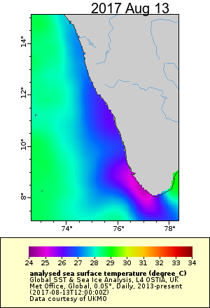

```{r setup, include=FALSE}
knitr::opts_chunk$set(echo = TRUE, warning=FALSE, results="hide", message=FALSE, fig.align="center")
```

The goal is to make a plot of chlorophyll along a transect line.  If you run the Rmd file, note that some of the data was saved to a file before knitting.  Search for `save()` and run and save those variables before knitting.

The motivation behind this is to show the chlorophyll front in an upwelling zone.
Here is an example of an upwelling zone in August (summer monsoon) off the west coast of India. This shows sea surface temperature. You can see the upwelling zone and we want to understand how that correlates with chlorophyll and in particular the chlorophyll front (sharp change from low to high).

```{r upwellingfig, fig.cap="SST off the west coast of India August 13, 2017.", results='asis', echo=FALSE, fig.width=6}

```

## Set up the transect

First we will set up our transect with points (lat/lon) every 10km on this line. This will use the **data.table**, **geotools** and **geosphere** packages to create equispaced points between two lat/lon points.

```{r}
library(data.table)
df <- data.frame(
  Latitude=c(9.9413972, 9.2),
  Longitude=c(76.2, 74)
  )
data.table::setDT(df)

dist.between = 10000 #in meters

library(geotools)
library(geosphere)    # for distHaversine
get.dist <- function(lon, lat) 
  geosphere::distHaversine(tail(cbind(lon,lat),-1), head(cbind(lon,lat),-1))
# The := function is in data.table
df[,dist:=c(0,cumsum(get.dist(Longitude,Latitude)))]

interp.dist <- function(var,dist) approx(dist,var,xout=seq(min(dist),max(dist),by=dist.between))$y
transect <- data.table::setDT(df)[,lapply(.SD,interp.dist,dist=dist), 
                    .SDcols=c("Latitude","Longitude","dist")]
```


Here is the transect line drawn on top of the bathymetry off the west coast. We use the **marmap** package to download bathymetry data and plot.

```{r}
library(marmap)
library(ggplot2)
xlims <- c(73,80)
ylims <- c(6,15)
bathydata<- getNOAA.bathy(xlims[1], xlims[2], ylims[1], ylims[2])

autoplot(bathydata, geom=c("r", "c")) + 
  scale_fill_etopo() +
  ylim(7,13) +
  xlim(73,79)+
  geom_point(aes(x=Longitude, y=Latitude), data=transect, alpha=1)
```

## Download chlorophyll along the transect

Next we need to download chlorophyll for the points on the transect. This will use the `xtracto()` function of the **rerddapXtracto** package 

The satellite data are taken from  the ERDDAP server at http://coastwatch.pfeg.noaa.gov/erddap/

### Install the rerddap packages if needed

```{r eval=FALSE}
require(devtools)
devtools::install_github("ropensci/rerddap")
devtools::install_github("rmendels/rerddapXtracto")
```

Load the packages.

```{r}
require(rerddap)
require(rerddapXtracto)
```


For convenience, make shorter names for the latitude and longitude data.

```{r}
xcoord <- transect$Longitude
ycoord <- transect$Latitude
```

Define the search "radius" in the x any y directions, in units of degrees

```{r}
xlen <- 0.2 
ylen <- 0.2
```

Set the date to use.

```{r}
thedate <- rep("2010-08-05", length(xcoord))
tcoord <-as.Date(thedate)
```

The `dataInfo()` call selects what dataset is chosen for the extraction. In this example the datset chosen is the 8-day SeaWiFS chlorophyll data:
*erdSW2018chla1day* will get daily data and 
*rdSW2018chlamday* will get monthly data.

```{r}
dataset <- 'erdSW2018chla8day'
dataInfo <- rerddap::info(dataset)
parameter <- 'chlorophyll'
```

Look at DataInfo to see if dataset has an altitude dimension. 
If it does, then the call to `rxtracto()` must define `zcoord`, if it doesn't then the call should not give `zcoord`.

```{r}
zcoord <- rep(0, length(xcoord))
```

Match up satellite data with the trackdata.  

```{r eval=FALSE}
swchl <- rxtracto(dataInfo, 
                  parameter=parameter, 
                  xcoord=xcoord, ycoord=ycoord,
                  tcoord=tcoord, xlen=xlen, ylen=ylen)
```

```{r loadswchl, echo=FALSE}
# the rxtracto call is not working when knitting
# save the swchl to a file before running
load("swchl.Rdata")
```

After it has completed the extraction the data.frame ‘swchl’ will contain as many columns as datapoints in the input file and will have the following names: 

* mean =              mean of data within search radius
* stdev =             standard deviation of data within search radius
* n =                 number of points found within search radius
* satellite date =    time of returned value
* requested lon min = min longitude of call (decimal degrees)
* requested lon max = max longitude of call (decimal degrees)
* requested lat min = min latitude of call (decimal degrees)
* requested lat max = max latitude of call (decimal degrees)
* requested date =    requested time in tag
* median =            median of data within search radius
* mad =               median absolute deviation of data within search radius

Shorten variable name for ease in referencing 

```{r}
names(swchl)[names(swchl)=="mean chlorophyll"] <- "mean"
```

Now make some plots of the data.First combine the two dataframes into one, so it will be easy to take into account the locations that didn’t retrieve a value.

```{r}
alldata <- data.frame(transect, time=tcoord, mean=swchl$mean)
alldata$km <- alldata$dist/1000
```

## Make a plot of mean chlorophyll from the coast

```{r}
ggplot(alldata) + geom_point(aes(x=dist/1000, y=mean)) + 
  labs(x="Distance from Coast (km)", y="Mean Chlorophyll (mg/m^3)",
       title=paste0("Mean Chlorophyll on ", tcoord[1]))
```

## Create a colorbar of the chlorophyll values

First we associate a color with the range of chlorophyll values. We'll fill in the NAs for chlorophyll with `approx()` (linear interpolation).

```{r}
alldata$approx <- approx(x=alldata$dist[!is.na(alldata$mean)], y=alldata$mean[!is.na(alldata$mean)], xout = alldata$dist)$y
```

Create colors for each level of chlorophyll.

```{r}
cuts = 20
my.colors = colorRampPalette(c("dark green", "yellow", "orange", "red"))
alldata$col = rev(my.colors(cuts))[as.numeric(cut(alldata$approx,breaks = cuts))]
```

Plot the colorbar with time on the axis. The data we used was 8-day averages so the colorbar width is set at 8-days.

```{r}
wid=8
xaxs <- seq(tcoord[1],tcoord[1]+wid, by=wid)
plot(xaxs, rep(0,length(xaxs)), 
     ylim=c(0,max(alldata$km)), type= "n", xlab = "", ylab = "Distance from Coast (km)")
for(j in 1:1){
  for(i in 1:dim(alldata)[1]){
  rect(xaxs[j], alldata$km[i], xaxs[j+1], alldata$km[i+1], col = alldata$col[i],
       border=NA) 
  }
}
```

## Create colorbars for the whole year

Now we will put these pieces together to make a plot of the chlorophyll gradient throughout the year. Here the NAs are left as is.

First set the dates to use. We use every 8-days in 2010 since we are using the 8-day dataset.

```{r}
thedate <- seq(as.Date("2010-01-01"), as.Date("2010-12-16"), by=8)
```

We want to get the chlorophyll data for the transect at each date.  We will store this in a matrix.

```{r echo=FALSE}
# downloading the Chl data takes a long time so I ran and saved the matrix to a file.
load("meanmat.RData")
```

```{r eval=FALSE}
dataset <- 'erdSW2018chla8day'
dataInfo <- rerddap::info(dataset)
parameter <- 'chlorophyll'
meanmat <- matrix(NA, length(xcoord), length(thedate))
for(i in 1:length(thedate)){
  tcoord <- rep(thedate[i], length(xcoord))
  swchl <- rxtracto(dataInfo, 
                  parameter=parameter, 
                  xcoord=xcoord, ycoord=ycoord,
                  tcoord=tcoord, xlen=xlen, ylen=ylen)
  names(swchl)[names(swchl)=="mean chlorophyll"] <- "mean"
  meanmat[,i] <- swchl$mean
  cat(i, " ")
}
save(meanmat, file="meanmat.RData")
```

Create a matrix like `meanmat` but with color for each value in `meanmat`.

```{r colormap}
cuts <- 50
my.colors <- colorRampPalette(c("dark green", "yellow", "orange", "red"))
# cut the chl values into levels and assign each level a number
chlcuts <- as.numeric(cut(as.vector(meanmat),breaks = cuts))

# take those levels and associate with the colorpalette
# reverse the color palette because we want high chl = green
cols <- rev(my.colors(cuts))[chlcuts]

# reassemble into a matrix like meammat
colmat <- matrix(cols, length(xcoord), length(thedate))
```

Now plot strips for each 8-day window. We will set the margin to leave some room for a colorbar. We will add a colorbar at the bottom using the `set.colorbar()` function in the **oceanmap** package. We need to fiddle a little with the `cby` value to get it in the right place.


```{r fig.height=4, fig.width=7}
par(mar=c(8,5,2,2))
wid=8
xaxs <- c(thedate, max(thedate)+wid)
n <- length(xaxs)
plot(xaxs, rep(0,n), 
     ylim=c(0,max(alldata$km)), type= "n", xlab = "", ylab = "Distance from coast (km)")
for(j in 1:length(thedate)){
  for(i in 1:dim(alldata)[1]){
  rect(xaxs[j], alldata$km[i], xaxs[j+1], alldata$km[i+1], col = colmat[i,j],
       border=NA) 
  }
}

colb <- rev(my.colors(cuts)) # our custom colors
# this bit of code gets the break points
tmp<-levels(cut(as.vector(meanmat),breaks = cuts))
tmp<-sapply(strsplit(tmp, "\\(|,|]"), function(x) as.numeric(x[-1]))
zlims<-tmp[1,]
oceanmap::set.colorbar(
  cbx=c(as.numeric(xaxs[1]), as.numeric(xaxs[n])), 
  cby=c(-100, -130), 
  pal=colb,
  zlim=zlims)
mtext("Chlorophyll (mg/m^3)", side=1, line=5)
title("Chlorophyll density off the coast in 2010")
```

## Applying to other remote sensing data

The chlorophyll plot did not work that well since the sensor for chlorophyll does not 'see' through clouds. The upwelling which drives the formation of chlorophyll blooms happens during the summer monsoon, and it is very cloudy during that time. However, you can use the same idea with other remote-sensing products on the NOAA ERDDAP data server: http://coastwatch.pfeg.noaa.gov/erddap/.


